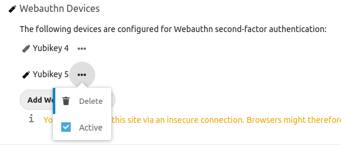

# Twofactor Webauthn
Place this app in **nextcloud/apps/**

## Usage

### Activation/Deactivation of devices

To activate or deactivate a device, click on the actions after the device name. There you can toggle the checkbox named _**Active**_. The change will be immediately saved. Per default, a newly added device will be active.



Deactivated devices can be recognised by the disabled state of the icon.

Only active devices can be used to authenticate. If no device is active, 2 factor authentication with webauthn will be disabled and a warning will be shown.

## Software Credits

The development of this software was made possible using the following components:

### twofactor_u2f
twofactor_u2f (https://github.com/nextcloud/twofactor_u2f) by Christoph Wurst (https://github.com/ChristophWurst)

Licensed Under: AGPL

This project used the great twofactor provider u2f created by Christoph Wurst as a template.

### webauthn-framework
webauthn-framework (https://github.com/web-auth/webauthn-framework) by Florent Morselli (https://github.com/Spomky)

Licensed Under: MIT

The webauthn-framework provided most of the code and documentation for implementing the webauthn authentication.


 

## Building the app

The app can be built by using the provided Makefile by running:

    make

This requires the following things to be present:
* make
* which
* tar: for building the archive
* curl: used if phpunit and composer are not installed to fetch them from the web
* npm: for building and testing everything JS, only required if a package.json is placed inside the **js/** folder

The make command will install or update Composer dependencies if a composer.json is present and also **npm run build** if a package.json is present in the **js/** folder. The npm **build** script should use local paths for build systems and package managers, so people that simply want to build the app won't need to install npm libraries globally, e.g.:

**package.json**:
```json
"scripts": {
    "test": "node node_modules/gulp-cli/bin/gulp.js karma",
    "prebuild": "npm install && node_modules/bower/bin/bower install && node_modules/bower/bin/bower update",
    "build": "node node_modules/gulp-cli/bin/gulp.js"
}
```


## Publish to App Store

First get an account for the [App Store](http://apps.nextcloud.com/) then run:

    make && make appstore

The archive is located in build/artifacts/appstore and can then be uploaded to the App Store.

## Running tests
You can use the provided Makefile to run all tests by using:

    make test

This will run the PHP unit and integration tests and if a package.json is present in the **js/** folder will execute **npm run test**

Of course you can also install [PHPUnit](http://phpunit.de/getting-started.html) and use the configurations directly:

    phpunit -c phpunit.xml

or:

    phpunit -c phpunit.integration.xml

for integration tests
